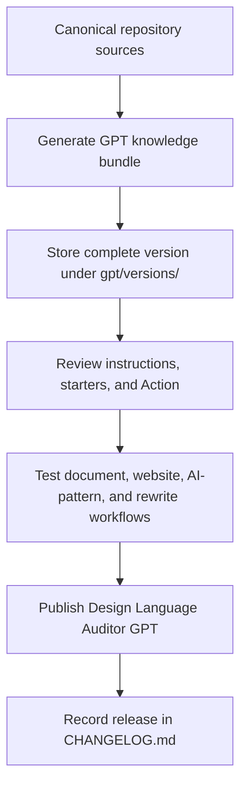

# Design Language Auditor GPT

This directory preserves the exact configuration published to the Design Language Auditor Custom GPT.

The repository is the source of truth for Design Language. Each version directory records the GPT instructions, conversation starters, external Action schema, release metadata, and generated knowledge bundle used by the published GPT.

## Architecture

## Published versions

| Design Language | GPT version | Configuration | Status |
| --- | --- | --- | --- |
| 1.0.1 | 1.0.1 | [`versions/v1.0.1/`](versions/v1.0.1/) | Published |

## Release rule

Every Design Language release requires a Custom GPT impact review. Follow [`docs/custom-gpt-release-process.md`](../docs/custom-gpt-release-process.md) and commit the exact published configuration for the release.

Public GPT: https://chatgpt.com/g/g-6a52996c067481919f69cde33a25b22d-design-language-auditor
